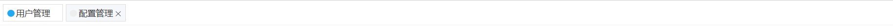

# vue-components

> C&amp;V TO USE🕹

## Tabs



```javascript
<template>
  <Tabs v-model="activeName">
    <TabsItem name="first">用户管理</TabsItem>
    <TabsItem
      name="second"
      :haveClose="true"
    >配置管理</TabsItem>
  </Tabs>
</template>

<script>
import Tabs from 'tabs/tabs.vue';
import TabsItem from 'tabs/tabs-item.vue';

export default {
  data() {
    return {
      activeName: 'first',
    };
  },
  components: {
    Tabs,
    TabsItem,
  },
};
</script>
```