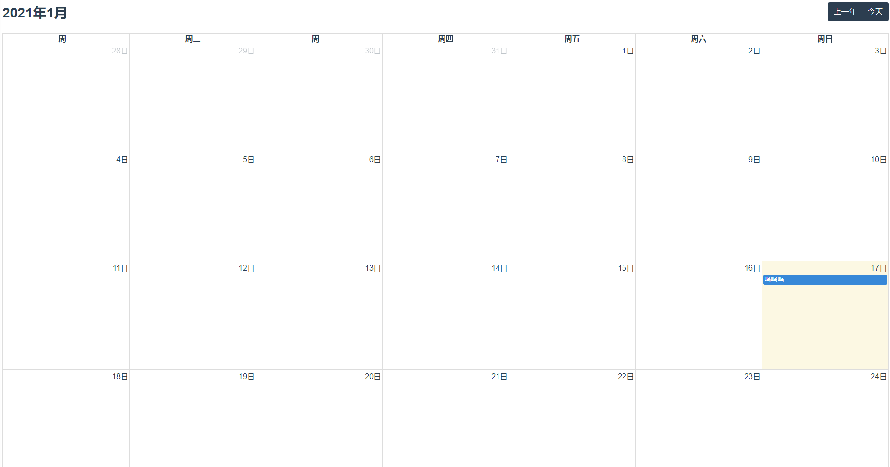

# Calendar 日历



```vue
<template>
  <v-calendar :options="options"></v-calendar>
</template>

<script>
export default {
  data() {
    return {
      options: null,
    }
  },
  created() {
    const self = this;
    this.options = {
      // 是否可以多选
      selectable: true,
      // 头部工具栏
      header: {
        left: 'title',
        center: '',
        right: 'custom1,custom2'
      },
      // 自定义按钮
      customButtons: {
        custom1: {
          text: '上一年',
          click: function() {
            alert('clicked custom button 1!');
          }
        },
        custom2: {
          text: '今天',
          click: function() {
            alert('clicked custom button 2!');
          }
        }
      },
      // 点击日期事件
      dateClick: function(info) {
        console.log(info, self, this);
      },
      // 事件标签渲染
      eventRender: function(info) {
        let italicEl = document.createElement('div');
        italicEl.innerHTML = '呜呜呜';

        info.el.innerHTML = '';
        info.el.appendChild(italicEl);
      },
      // 事件
      events: [
        {
          title: '08:08 干饭',
          start: '2021-01-17',
          ceshi: ['测试文本'],
        },
      ]
    }
  },
}
</script>
```